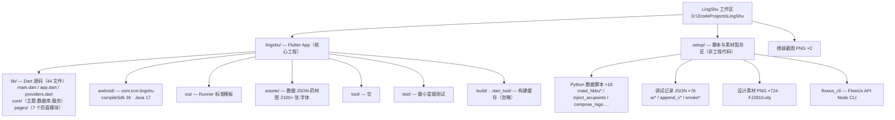

# CLAUDE.md — LingShu 工作区（根级索引）

> 本文件是 AI 编码助手的工作区级上下文索引。模块详情见 [lingshu/CLAUDE.md](lingshu/CLAUDE.md)。

## 工作区愿景

「灵枢」（LingShu）是一款**阴阳五行 × 中医风格的个人/家庭健康管理 App**（Flutter，中文界面）。名字取自《黄帝内经·灵枢》，"枢"喻健康数据之枢纽。核心理念：**健康数据不出本机**——数据库整体 SQLCipher 加密，AI 识别仅在用户自行配置 API Key 后调用视觉大模型。

核心功能：3D 经穴铜人（首页）、健康档案库（拍照 AI 归档）、家庭成员档案、健康指标追踪、用药提醒、急救指南（26 场景）、中医体质辨识、中药图鉴（879 味）、家庭小药箱。

## 工作区结构总览

| 顶层条目 | 性质 | 说明 |
|---|---|---|
| `lingshu/` | **核心工程** | Flutter 应用项目（唯一活跃代码库），详见 [lingshu/CLAUDE.md](lingshu/CLAUDE.md) |
| `.setup/` | 脚本/素材暂存区 | 数据生产脚本（18 个 Python：爬取 HKBU 药材图片、注入穴位数据、生成 Logo 等）、调试 JSON 记录（ar*/append_v*/smoke*）、设计素材 PNG（724 张）、FJ2810.obj 人体扫描模型、flowus_cli（FlowUs V2 API 的 Node CLI 工具）。**非工程代码，勿当依赖引用** |
| `collection_fixed2.png`、`detail_fixed.png` | 截图 | 根目录遗留设计截图 |
| `.zcode/plans/` | 工具目录 | ZCode 计划文件 |



## 模块索引

| 模块 | 路径 | 文档 | 一句话职责 |
|---|---|---|---|
| 灵枢 App | `lingshu/` | [lingshu/CLAUDE.md](lingshu/CLAUDE.md) | Flutter 健康管理应用全部源码、平台配置与资产 |

（`.setup/` 为暂存区，不生成模块文档；如需了解某个数据脚本的用途，直接读 `.setup/` 下同名 .py 文件头部注释。）

## 全局开发规范

- **路径引用一律用相对路径**（本次跨盘迁移的教训：绝对路径会失效）。
- 只在 `lingshu/` 内写代码；`.setup/` 仅作数据生产与素材来源，产出物通过脚本注入 `lingshu/assets/`。
- 忽略 `lingshu/build/`、`lingshu/.dart_tool/`、`lingshu/android/.gradle/` 等生成目录；二进制大文件（png/obj/apk/glb）不要整读。
- 代码规范遵循 `lingshu/analysis_options.yaml`（flutter_lints 6，exclude build/android/ios）。
- 语言与 UI：应用面向中文用户（zh_CN 为主 locale），注释与文档用中文，UI 文案用中文。

## 常用命令

均在 `lingshu/` 目录下执行（Flutter 3.47.4 stable 位于 `D:\dev\flutter`，已写入 `android/local.properties`）：

```bash
cd lingshu
flutter pub get          # 拉取依赖（pubspec.lock 已锁定）
flutter run              # 调试运行（连接设备/模拟器）
flutter analyze          # 静态检查
flutter test             # 跑测试（目前仅 1 个冒烟测试）
flutter build apk        # 构建 Android APK（release 用 debug 签名）
flutter clean            # 清理构建缓存（迁移后建议先执行）
```

Drift 代码生成（修改 `lib/core/db.dart` 表结构后必须执行）：

```bash
cd lingshu && dart run build_runner build --delete-conflicting-outputs
```

## 迁移注意事项（2026-10-03）

- 本工作区已从旧位置**整体迁移**至 `D:\ZcodeProjects\LingShu`。
- `lingshu/android/local.properties` 已更新并验证有效：`sdk.dir=D:\dev\android-sdk`、`flutter.sdk=D:\dev\flutter`。该文件是机器本地配置，不含敏感信息。
- `build/`、`.dart_tool/` 均为旧路径缓存产物，**重建前建议先 `flutter clean`**，否则 Gradle/Dart 增量缓存可能因旧绝对路径报错。
- 根目录的 `lingshu/灵枢_v0.1.0_release.apk`（约 98MB）与 `lingshu/dist/lingshu.apk` 为历史构建产物，可删除以瘦身，不影响工程。
- 项目当前不在 Git 仓库中（无 `.git/`），无远程提交风险；迁移后建议初始化版本控制。
