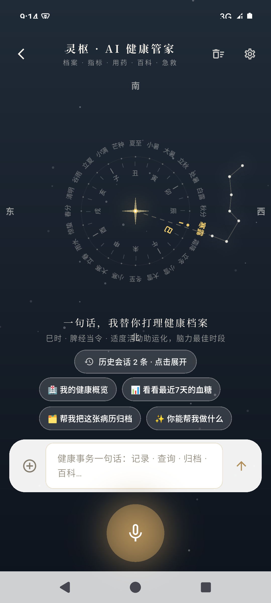

<div align="center">

# 灵枢 · LingShu

**身有灵枢，健康有度**

把全家的健康，装进一个**离线、加密、长得像中医典籍**的 App。


  

取意《黄帝内经·灵枢》——专论经络穴位之篇，"枢"亦喻健康数据之枢纽。

</div>

---

## ✨ 为什么是灵枢

- 🏮 **五行美学，不是又一个白底蓝按钮的健康 App** —— 宣纸米白底 × 木火土金水五色体系，思源宋体，太极、云纹、篆刻、木质药柜，每一屏都像摊开一册中医典籍
- 🔒 **数据不出手机** —— SQLCipher 全库加密 + PIN 锁屏，无账号、无云端、无追踪；AI 自己配 Key、自己开关
- 🌌 **AI 健康管家：一句话，指挥全 App** —— 打字、拍照、按住说话都行：归档病历、查指标画趋势图、口述记血压、建用药提醒、翻药箱、查中药讲穴位……15 类动作自动分派，答完常带一个「打开」按钮直达对应页面
- 👨‍👩‍👧 **一人一档，全家共用** —— 家庭成员自由切换，档案、用药、药箱按人归置

## 🧭 功能一览

### 🌌 AI 健康管家 · 一句话，指挥全 App

全能力智能体入口：北斗七星星野在页间流转，表盘标注十二地支、按当下时辰给出**子午流注**养生提示。文字、多图、语音（按住语音球说话）三种进法，AI 自动分派到全 App 的 15 类动作——

> 🗂「帮我把这张病历归档」 · 📊「看看最近7天的血糖」 · ✍️「记一下 血压130/85 心率76」 · 💊「提醒我每天早晚8点吃一次降压药」 · 🧰「药箱里有什么快过期了？」 · 🚑「烫伤了怎么急救？」 · 🌿「黄芪的功效和禁忌」 · ⚡「合谷穴在哪里？」 · ☯️「我的体质怎么调养？」 · 🗓「今天什么节气怎么养生？」 · 🏥「我的健康概览」……

回复支持**一键复制**（长按气泡也行）；问「你能帮我做什么」会得到可点选的能力清单——这句是本地识别的，**没配 API Key 也能用**；会话历史落盘保存，默认收起不打扰，可一键清空。

| | |
| :---: | :---: |
|  |  |
| 北斗星野 · 快捷能力点选 · 语音球 | ✦ AI 在你家药箱里挑药（只传药品名文字，不传照片） |

### 🗺️ 经络穴位挂图 · 一眼定位

361 经穴高清挂图，正面/背面/侧面三视图；**十二正经 + 奇经八脉**全部上图（八脉以朱砂红单独分层，冲脉、带脉、阴阳跷、阴阳维一览无余），按经络筛选高亮循行；搜索穴位即刻在图上**闪烁定位**，其余自动灰掉。穴名带拼音声调，详情页附《灵枢》原文。

| | |
| :---: | :---: |
|  |  |
| 按经络筛选，循行线高亮 | 穴位详情：拼音 · 归经 · 主治 · 《灵枢》原文 |

### 📁 健康档案库 · 拍照即入库

拍照/相册导入报告单，AI 视觉大模型自动提取医院、日期与**指标数值**，确认后入库；按「人 → 年 → 月」时间线归档，自动定位记录附近医院。

| | |
| :---: | :---: |
|  |  |
| AI 识别归档：摘要与原件同屏 | 时间线分组，一屏纵览检查史 |

### 📈 指标追踪 · 趋势看得见

预设血压/血糖/血脂/体温等指标，支持自定义；参考区间带与异常点高亮，19 类指标自动归类（凝血、电解质、基础体征……），点 ✦ 让 AI 把「其他」归位。血压心率一屏合并录入，**语音口述**「血压130/85 心率76」自动落格。

| | |
| :---: | :---: |
|  |  |
| 参考区间带 + 异常点高亮 | ✦ AI 归类后的指标分组速览 |

### 🗄️ 家庭小药箱 · 会提醒，还会找药

从家庭成员选人组「小家庭」，一家庭一药箱；**木格药柜**一格一药，临期自动变色，拉开柜门看原始照片。到期前 6/3/1 个月自动提醒，过期每天催一次。

**✦ AI 找药**（v0.1.36 新增）：一句话说需求——「有没有治感冒的药」——AI 在你家药箱里挑出相关药品；只上传药品名与用法用量的文字，不上传照片。

| | |
| :---: | :---: |
|  |  |
| 木格药柜，临期变色 | ✦ 一句话，AI 帮你翻药柜 |

### 🚑 急救指南 · 离线速查

以 IFRC《国际急救指南》为蓝本的场景卡：CPR+AED、海姆立克、中风 FAST、过敏性休克……步骤化图文全程离线，紧急时刻不看广告、不等加载。

| | |
| :---: | :---: |
|  |  |
| 20+ 场景速查 | 步骤化图文，注明来源 |

### 💊 用药提醒 · 🌗 体质与节气

每日 N 次/间隔/每周几、三餐前后（同时间多种药合并一卡），准点通知提醒 + 依从性打卡；排程引擎带权限自检——系统没授「精确闹钟」就自动降级并**如实告知排上了几条**，绝不静默失效；还可一键把提醒**同步进系统时钟 App**（真闹钟响铃）。中医九种体质标准问卷 + 节气子午流注养生卡。

| | |
| :---: | :---: |
|  |  |
| 依从性打卡记录 | 九种体质辨识问卷 |

## ⬇️ 下载

| 渠道 | 说明 |
| --- | --- |
| [GitHub Releases](https://github.com/JetYeah/LingShu/releases/latest) | `lingshu_vX.Y.Z_release_arm64.apk`，arm64 专版（2018 年后的手机均可安装），覆盖安装数据全保留 |

> 首次使用：创建主人档案 →（可选）在「我的 → 设置」配置 AI 接口的 base_url 与 Key（默认兼容 GLM 系列的 OpenAI 协议接口，视觉/对话/语音识别可共用一把 Key）。不配置也能用：挂图、档案手动录入、用药提醒、急救、体质问卷全部离线可用，AI 管家的能力清单也可点选直达。

## 🔒 隐私立场

- 健康数据**全部本地存储**，SQLCipher 加密，PIN/生物识别锁屏
- AI 需自行配置接口、**默认关闭**；开启后也只有你主动发送的内容才会请求大模型（AI 找药仅上传药品名文字清单，不上传照片）
- 无账号体系、无云端同步、无埋点追踪

## 🛠️ 技术栈与本地构建

Flutter · Riverpod · go_router · Drift(SQLite + SQLCipher) · flutter_local_notifications · fl_chart · GLM 系列（OpenAI 兼容接口：视觉归档 / 管家对话 / 语音转写）

```bash
cd lingshu
flutter pub get
flutter run              # 调试
flutter build apk --release --split-per-abi   # release（arm64 包用于发布）
```

## ⚠️ 免责声明

本应用内容（含穴位、体质、养生建议）仅供健康记录与参考，**不构成医疗建议**；急症请拨打 120 并遵医嘱。

## 📄 License

[MIT](LICENSE) © 2026 JetYeah
